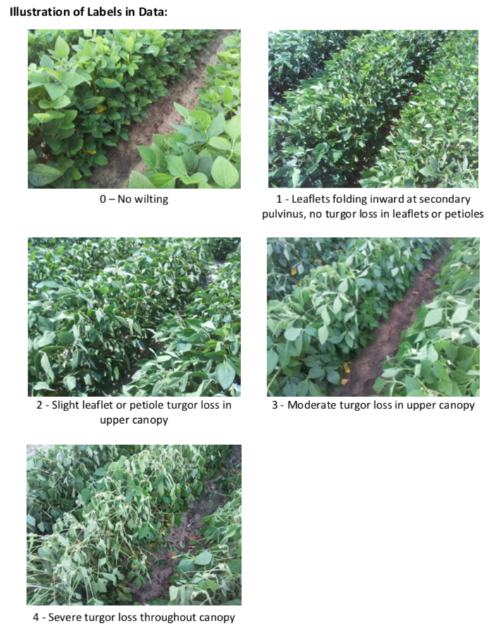

# Leaf-Wilting-Detection-Transfer-Learning
A ResNet50 based model to tackle the multi-class classification problem of detecting leaf wilting levels. This was my project in "ECE542: Neural Networks and Deep Learning" course at NC State University.

## Dataset

The dataset was provided by Dr. Lobaton at NC State University. The training images capture the condition of the soybean crop at various times of the day with each image and its label being in the range [0,1,2,3,4] with 4 being the highest wilting and 0 denoting the lowest wilting in soybean leaves.

Here is an image that illustrates a single image from each wilting level.

## Motivation

Weather stress and climate change are major challenges for agriculture. Drought tolerant soybean varieties are required but their breeding is difficult. Soybean breeders evaluate thousands of field plots annually in order to select the best plants to advance for further testing or to release as a new variety. The most widely used indicator of drought tolerance/sensitivity in soybean is leaf wilting during periods of water stress and breeders collect this data in the most low-tech way imaginable — walking the field with a notebook and writing down ratings to indicate how wilted each field plot looks. The aforementioned strategy is extremely time-consuming and such a manual process warrants automation. Also, it’s impossible for a breeder to rate all their plots in one day. On top of that, field sites are usually located far away from the office, meaning that a breeder generally must drop everything and devote an entire day to collecting wilting ratings for just a subset of their plots. It is also unclear when it is best to collect wilting ratings. Several questions need to be addressed:

* Are the data more useful during periods of mild stress, moderate stress, or severe stress? 
* What time of day or set of atmospheric conditions provides the most useful wilting information? 
* How are leaf wilting ratings connected to plant physiology? These questions are hard to answer with manual annotations.

Our goal is to use temporally high-throughput image data, which represent two different soybean genotypes responding to a wide range of atmospheric and soil moisture conditions, as a training dataset to automate leaf wilting ratings. With automated ratings, we could generate larger datasets that would allow us to answer some of the questions above. We want to eventually automate leaf wilting ratings for hundreds or thousands of plots across a field, which is a spatially high throughput application.

## Objective

The objective of the project is to build a machine learning classifier that is able to classify each test image's wilting level.

## Approach (in brief)

#### Part 1: Traditional Machine Learning

Each image, of dimension 480x640, in the training dataset is read as a grayscale image. The image is flattened and PCA is performed to pick out the pixels that capture the most amount of variance in the image. Top 800 pixels are selected as they capture more than 95% of variance. These 800 length vectors are then passed to a traditional Linear SVM classifier and the accuracy is measured on the stratified validation dataset. The training is done in a class-weighted form since the dataset is highly imbalanced. More details about the approach can be found in the [ProjC1 Report](Reports/ProjC1_Report.pdf).

#### Part 2: Transfer Learning

Each RGB image is resized to 224 x 224 dimension and passed to a ResNet50 base model. The top layer is removed and is replaced by 2 fully connected layers to learn domain specific features. The final layer is a 5 neuron layer with softmax activation that outputs the probability of the image being in each class. The class with the maximum probability is selected as the class for the image. The training is done in a class-weighted form since the dataset is highly imbalanced. More details about the approach can be found in the [ProjC2 Report](Reports/ProjC2_Report.pdf).

## Results

#### Part 1: Traditional Machine Learning

We were able to achieve 79.02% validation accuracy on the stratified validation dataset. The F-1 scores for individual classes were also high. However, the test accuracy achieved was just 20% where the threshold was an accuracy of 50%. The model was improved by approach part 2.

#### Part 2: Transfer Learning

We were able to achieve 65% validation accuracy on a balanced dataset which properly resembled the balanced test dataset. The test accuracy score achieved was 57% which passed the threshold of 50%.

For a more detailed discussion on the approach and the results achieved, kindly take a look at the folder [Reports](Reports/).

## Weather Data (Extra Credit)

We were also given a relatively small data in the form of weather conditions noted for some images in the training dataset. We used an ensemble approach to improve upon the accuracy in this extra credit data. For this extra credit portion, we were given the test dataset with the true labels. Firstly, we used a PCA based SVM model to eliminate useless features from the tabular data to achieve 72% test accuracy. Secondly, we built an image-based model which was the ResNet model with best parameters found in Part 2 approach. The image only model achieved a 78% accuracy on the test dataset. Finally, the ensemble model combined the confidence scores from both the image-only and tabular data models to improve and reached a maximum test accuracy of 82%.
